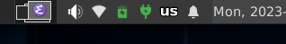
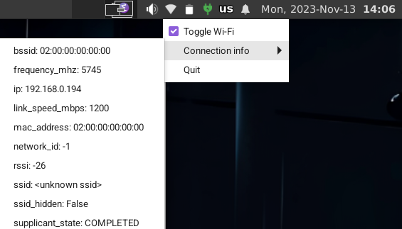
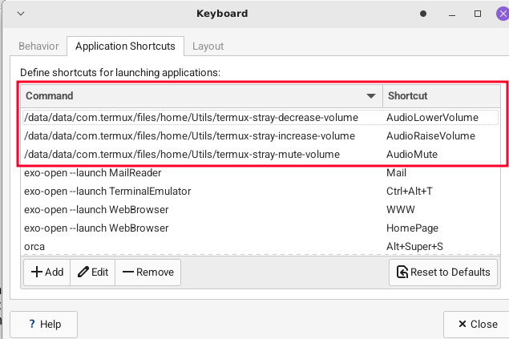

# Termux Stray

A (hopefully) useful and extremelly simple system tray app to display the status of:
- Battery
- Wi-Fi
- Audio Volume

inside [Termux](https://github.com/termux/termux-app). Tested using Xfce with [Termux-X11](https://github.com/termux/termux-x11).

To use it you must have installed the `termux-api` package via `pgk install termux-api`. In particular the following commands are employed:

- `termux-battery-status`
- `termux-wifi-connectioninfo`
- `termux-wifi-enable`
- `termux-volume`

See the limitations section below.

## Installation
Just drop the directory with all the files anywhere you want and run it.

You might want to create a symbolic link to:

- `termux-stray`
- `termux-stray-send-command`
- `termux-stray-decrease-volume`
- `termux-stray-increase-volume`
- `ttermux-stray-mute-volume`

somewhere in your `PATH`, such as `/data/data/com.termux/files/home/.local/bin`.

Additionally, to use the multimedia keys to control the volume add the appropriate hot key in (if Xfce) `Applications > Settings > Keyboard -> Application Shortcuts` like so:

And, of course, add a startup entry in `Applications > Settings > Session and Startup > Application Autostart` pointing to wherever you chose to place `termux-stray`. 

## Limitations

1. Since no direct (that I know of!) callback to a termux app notifying a status change is available, polling is employed. This causes a somewhat annoying delay between status changes and the update on the icons. You can change the polling rate in the config file (including different polling rates for battery/ac energy sources).

2. Since some forsaken Android version, sensitive information (such as clipboard and network connection information) is only available for the app which has the focus/is visible. `termux-xxx`  commands (on which the system tray icons are based) might seem to be run from an app that has the focus (Termux X11, VNC, ...) but actually they are being run inside Termux (which usually is not visible). Therefore information such as available wifi networks, or current SSID is often not available. You mileage may vary depending on Android version, ft your device is rooted, or if it runs on a custom ROM, ...

